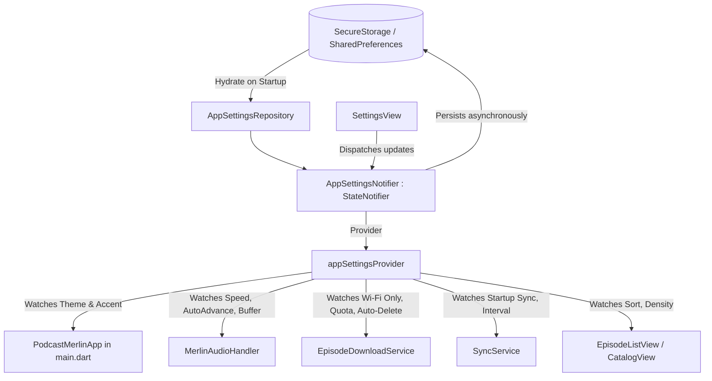

# Podcast Merlin: App Configurability Proposal & Implementation Plan

**Branch**: `feature/app-configurability`  
**Worktree Location**: `.worktrees/configurability`  
**Date**: October 2026  

---

## 1. Executive Summary

An architectural audit of Podcast Merlin identified key areas where hardcoded defaults restrict user customization. While core features (audio playback, streaming downloads, Nextcloud gPodder sync, and OPML handling) are functional, user experience and battery/data conservation can be significantly improved by exposing configurable settings.

This document details the discovered hardcoded behaviors, proposes high-value configuration options across five domains, defines the state management architecture, and outlines a phased implementation plan.

---

## 2. Hardcoded Defaults & Proposed Settings Catalog

### A. Playback & Player Controls

| Current Hardcoded Behavior | File Reference | Proposed Configurable Setting | Proposed Default | Control Type | Description & Rationale |
| :--- | :--- | :--- | :--- | :--- | :--- |
| **Playback speed is ephemeral**; resets to `1.0x` on every app restart. | [`lib/features/player/audio_player_service.dart:62`](file:///home/yehonatanv/projects/podcastMerlinRebooted/.worktrees/configurability/lib/features/player/audio_player_service.dart#L62) | **Default Playback Speed** | `1.0x` | Dropdown / Slider (`0.5x`–`3.0x`) | Persist user's listening speed preference across app sessions. |
| **Queue always auto-advances** to the next episode upon completion. | [`lib/features/player/audio_player_service.dart:1076`](file:///home/yehonatanv/projects/podcastMerlinRebooted/.worktrees/configurability/lib/features/player/audio_player_service.dart#L1076) | **Continuous Playback (Auto-play Next)** | `Enabled` (`true`) | Switch | When disabled, stops playback at the end of each episode. Essential for bedtime listening. |
| **Mark-as-played threshold** is locked to $\le 60\text{s}$ remaining. | [`lib/features/player/audio_player_service.dart:965`](file:///home/yehonatanv/projects/podcastMerlinRebooted/.worktrees/configurability/lib/features/player/audio_player_service.dart#L965) | **Mark-as-Played Buffer** | `60s` | Dropdown (`At end`, `30s`, `60s`, `90s`, `2m`) | Lets users skip long outros, credits, and sponsor tags without leaving episodes unfinished. |
| **Audio ducking** drops volume to `50%` on audio focus loss. | [`lib/features/player/audio_player_service.dart:288`](file:///home/yehonatanv/projects/podcastMerlinRebooted/.worktrees/configurability/lib/features/player/audio_player_service.dart#L288) | **Audio Focus Loss Action** | `Pause & Resume` | Dropdown (`Pause & Resume`, `Duck 50%`) | Voice podcasts become unintelligible when ducked under turn-by-turn navigation or notifications. |
| **Sleep timer fade-out** is hardcoded to the final 15 seconds. | [`lib/features/player/audio_player_service.dart:1191`](file:///home/yehonatanv/projects/podcastMerlinRebooted/.worktrees/configurability/lib/features/player/audio_player_service.dart#L1191) | **Sleep Timer Fade-Out Duration** | `15s` | Dropdown (`Disabled`, `10s`, `15s`, `30s`) | Customizable ramp-down time before sleep timer cuts audio. |
| **Skip silence** native engine feature is unexposed. | `just_audio` | **Skip Silence** | `Disabled` (`false`) | Switch | Trims conversational pauses natively for faster listening without pitch shift. |

---

### B. Downloads, Network & Storage Management

| Current Hardcoded Behavior | File Reference | Proposed Configurable Setting | Proposed Default | Control Type | Description & Rationale |
| :--- | :--- | :--- | :--- | :--- | :--- |
| **Downloads occur over cellular** indiscriminately (no network gating). | [`lib/features/downloads/episode_download_service.dart:23`](file:///home/yehonatanv/projects/podcastMerlinRebooted/.worktrees/configurability/lib/features/downloads/episode_download_service.dart#L23) | **Download on Wi-Fi Only** | `Enabled` (`true`) | Switch | Prevents accidental consumption of limited mobile data quotas. |
| **Max concurrent downloads** is hardcoded to `2`. | [`lib/features/downloads/episode_download_service.dart:72`](file:///home/yehonatanv/projects/podcastMerlinRebooted/.worktrees/configurability/lib/features/downloads/episode_download_service.dart#L72) | **Max Concurrent Downloads** | `2` (Range: 1–5) | Segmented / Dropdown | Adjust download queue concurrency based on network bandwidth. |
| **Downloaded files are never auto-deleted** upon completion. | [`lib/features/player/audio_player_service.dart:1031`](file:///home/yehonatanv/projects/podcastMerlinRebooted/.worktrees/configurability/lib/features/player/audio_player_service.dart#L1031) | **Auto-Delete Played Episodes** | `Immediately` | Dropdown (`Never`, `Immediately`, `After 24h`, `After 7d`) | Automatically frees disk space as episodes are listened to. |
| **No auto-download** of newly released episodes. | [`lib/features/sync/sync_service.dart:480`](file:///home/yehonatanv/projects/podcastMerlinRebooted/.worktrees/configurability/lib/features/sync/sync_service.dart#L480) | **Auto-Download New Episodes** | `Disabled` (`false`) | Switch + Max Per Show (`1`, `3`, `5`) | Ensures fresh episodes of favorite shows are ready for offline commuting. |
| **Unlimited download storage** with no quota warning or eviction. | [`lib/features/downloads/episode_download_service.dart:1035`](file:///home/yehonatanv/projects/podcastMerlinRebooted/.worktrees/configurability/lib/features/downloads/episode_download_service.dart#L1035) | **Max Download Storage Quota** | `10 GB` | Dropdown (`None`, `2 GB`, `5 GB`, `10 GB`, `20 GB`) | Prevents the app from filling up device internal storage. |
| **Download folder** is locked to app private storage. | [`lib/features/downloads/episode_download_service.dart:116`](file:///home/yehonatanv/projects/podcastMerlinRebooted/.worktrees/configurability/lib/features/downloads/episode_download_service.dart#L116) | **Custom Download Directory** | App Default | Folder Picker with Reset | Supports Android SD cards and Linux/Desktop custom media partitions. |

---

### C. Synchronization & gPodder Integration

| Current Hardcoded Behavior | File Reference | Proposed Configurable Setting | Proposed Default | Control Type | Description & Rationale |
| :--- | :--- | :--- | :--- | :--- | :--- |
| **Sync never runs automatically**; only on manual refresh. | [`lib/features/ui/views/main_shell.dart:47`](file:///home/yehonatanv/projects/podcastMerlinRebooted/.worktrees/configurability/lib/features/ui/views/main_shell.dart#L47) | **Sync on App Launch** | `Enabled` (`true`) | Switch | Keeps subscriptions and progress up-to-date on startup. |
| **No periodic background sync** interval while running. | [`lib/features/sync/sync_service.dart:53`](file:///home/yehonatanv/projects/podcastMerlinRebooted/.worktrees/configurability/lib/features/sync/sync_service.dart#L53) | **Periodic Feed & Progress Sync** | `Every 3 Hours` | Dropdown (`Manual`, `1h`, `3h`, `6h`, `12h`) | Periodically fetches new episodes without requiring manual pull-to-refresh. |
| **Sync conflict policy** blindly overwrites local position with server. | [`lib/core/database/database_helper.dart:1515`](file:///home/yehonatanv/projects/podcastMerlinRebooted/.worktrees/configurability/lib/core/database/database_helper.dart#L1515) | **Sync Conflict Resolution** | `Furthest Position Wins` | Dropdown (`Furthest Position`, `Latest Timestamp`, `Server Always`) | Resolves playback divergence between multiple devices safely. |
| **Device ID** is hardcoded string `'podcast_merlin_flutter'`. | [`lib/core/models/gpodder_action.dart:24`](file:///home/yehonatanv/projects/podcastMerlinRebooted/.worktrees/configurability/lib/core/models/gpodder_action.dart#L24) | **Device Identifier** | `podcast_merlin_flutter` | Text Field | Allows identifying distinct devices in Nextcloud gPodder. |

---

### D. Appearance & User Interface

| Current Hardcoded Behavior | File Reference | Proposed Configurable Setting | Proposed Default | Control Type | Description & Rationale |
| :--- | :--- | :--- | :--- | :--- | :--- |
| **ThemeMode** is hardcoded to `ThemeMode.system`. | [`lib/main.dart:106`](file:///home/yehonatanv/projects/podcastMerlinRebooted/.worktrees/configurability/lib/main.dart#L106) | **App Theme** | `System` | Segmented Button (`System`, `Light`, `Dark`, `AMOLED Black`) | User-selectable theme with true-black support for OLED battery savings. |
| **Primary seed color** is locked to `#6750A4` / `#D0BCFF`. | [`lib/main.dart:95, 102`](file:///home/yehonatanv/projects/podcastMerlinRebooted/.worktrees/configurability/lib/main.dart#L95) | **Accent Color** | `Merlin Purple` | Preset Swatches (Purple, Indigo, Blue, Teal, Amber, Coral) | Personalized visual branding. |
| **Initial landing tab** is hardcoded to Tab `0` (Catalog). | [`lib/features/ui/views/main_shell.dart:47`](file:///home/yehonatanv/projects/podcastMerlinRebooted/.worktrees/configurability/lib/features/ui/views/main_shell.dart#L47) | **Default Startup Tab** | `Catalog` | Dropdown (`Catalog`, `Episodes`, `Downloads`, `Discovery`) | Lets daily listeners open directly to Recent Episodes or Downloads. |
| **Episode list tile layout** is fixed-height. | [`lib/features/ui/views/episode_list_view.dart:1306`](file:///home/yehonatanv/projects/podcastMerlinRebooted/.worktrees/configurability/lib/features/ui/views/episode_list_view.dart#L1306) | **Compact Episode Rows** | `Disabled` (`false`) | Switch | Reduces row height and thumbnail size to fit more episodes on screen. |
| **Episode list sort order** is hardcoded to `ORDER BY pubDate DESC`. | [`lib/core/database/database_helper.dart:707`](file:///home/yehonatanv/projects/podcastMerlinRebooted/.worktrees/configurability/lib/core/database/database_helper.dart#L707) | **Default Episode Sort** | `Newest First` | Dropdown (`Newest First`, `Oldest First`) | Vital for serialized podcasts where listening from episode 1 is required. |
| **Completed episodes** cannot be hidden globally across views. | [`lib/features/ui/views/episode_list_view.dart:417`](file:///home/yehonatanv/projects/podcastMerlinRebooted/.worktrees/configurability/lib/features/ui/views/episode_list_view.dart#L417) | **Hide Completed Episodes** | `Disabled` (`false`) | Switch | Declutters episode lists by hiding finished episodes. |

---

### E. Discovery & Feed Parsing

| Current Hardcoded Behavior | File Reference | Proposed Configurable Setting | Proposed Default | Control Type | Description & Rationale |
| :--- | :--- | :--- | :--- | :--- | :--- |
| **Search engine selection** resets to iTunes on restart. | [`lib/features/discovery/multisource_search_service.dart:7`](file:///home/yehonatanv/projects/podcastMerlinRebooted/.worktrees/configurability/lib/features/discovery/multisource_search_service.dart#L7) | **Preferred Search Provider** | `Apple Podcasts` | Dropdown (`Apple Podcasts`, `Podcast Index`) | Remembers user choice between Apple Podcasts and Podcast Index. |
| **PodcastIndex API credentials** inputs are missing from UI. | [`lib/features/discovery/podcast_index_provider.dart:13`](file:///home/yehonatanv/projects/podcastMerlinRebooted/.worktrees/configurability/lib/features/discovery/podcast_index_provider.dart#L13) | **Custom PodcastIndex API Keys** | Empty | Text Fields with validation | Allows using personal API keys for unrestricted directory access. |
| **Image cache grows unbounded** without size info or manual clearing. | [`lib/core/services/image_cache_service.dart:18`](file:///home/yehonatanv/projects/podcastMerlinRebooted/.worktrees/configurability/lib/core/services/image_cache_service.dart#L18) | **Image Cache Management** | N/A | Storage indicator + "Clear Cache" button | Displays cached artwork disk usage and lets users reclaim storage. |

---

## 3. Architecture & State Management

### Components
1. **`AppSettings` Model**: An immutable data class encapsulating typed preferences with defaults.
2. **`AppSettingsNotifier`**: Riverpod `StateNotifier<AppSettings>` handling synchronous UI state updates and asynchronous persistence.
3. **Reactive Binding**: Key services (`MerlinAudioHandler`, `EpisodeDownloadService`, `SyncService`) observe relevant settings slices and adapt their behavior dynamically without app restarts.
4. **Settings Screen Reorganization**: Transform `SettingsView` from a flat form into categorized expandable sections or sub-views:
   - *Appearance & Interface*
   - *Playback & Audio Controls*
   - *Downloads & Offline Storage*
   - *Synchronization (Nextcloud / gPodder)*
   - *Discovery & Feed Parsing*

---

## 4. Phased Implementation Plan

### Phase 1: Core Settings Layer & Appearance
- [ ] Create `AppSettings` model and `appSettingsProvider` with persistence in `SecureStorageService`.
- [ ] Update `main.dart` to watch `themeMode` and accent colors (including AMOLED True Black).
- [ ] Update `main_shell.dart` to honor the configured default landing tab.
- [ ] Add compact episode row density and default sort order (`ASC`/`DESC`) in `episode_list_view.dart` and `database_helper.dart`.

### Phase 2: Playback & Audio Controls
- [ ] Persist and restore playback speed across app launches in `audio_player_service.dart`.
- [ ] Implement continuous playback toggle (queue auto-advance control).
- [ ] Support configurable mark-as-played buffer threshold and audio focus loss action (Pause vs Duck).
- [ ] Add customizable sleep timer fade-out duration in `sleep_timer_bottom_sheet.dart`.

### Phase 3: Downloads, Storage & Network Policies
- [ ] Implement Wi-Fi-only network constraint in `episode_download_service.dart`.
- [ ] Allow dynamic adjustment of `maxConcurrentDownloads` (1 to 5).
- [ ] Implement post-playback auto-deletion hook when episodes finish playing.
- [ ] Add image cache disk calculation and cache purge action to `image_cache_service.dart`.

### Phase 4: Sync Automation & Discovery Settings
- [ ] Implement sync-on-launch and periodic sync timer in `main_shell.dart`.
- [ ] Persist discovery provider preference and add custom PodcastIndex API credentials UI to `settings_view.dart`.
- [ ] Reorganize `settings_view.dart` into categorized, accessible sections with clean styling.
