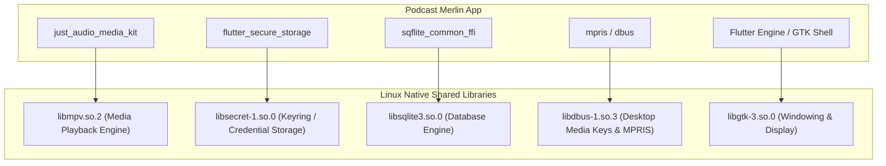

# Podcast Merlin: System Dependencies & Packaging Guide

> **Document Version**: 1.0.0  
> **Target Audience**: Maintainers, packagers (RPM, DEB, Flatpak, Snap, Arch AUR), and contributors building from source.  
> **Platforms Covered**: Linux (primary focus), Windows, macOS, Android.

---

## 1. Overview & Architecture

Podcast Merlin (`podcast_merlin_flutter`) is a cross-platform Flutter application. While Flutter packages handle high-level logic, desktop platforms interface with native C/C++ system libraries via FFI (Foreign Function Interface) and dynamic linkers.



---

## 2. Linux System Dependencies

### 2.1 Core Dependency Matrix

| Library | Soname / File | Purpose in Podcast Merlin | Build Package | Runtime Package |
| :--- | :--- | :--- | :--- | :--- |
| **libmpv** | `libmpv.so.2` (or `.so.1`) | Audio decoding, buffering & playback engine (`media_kit`) | `mpv-devel` / `libmpv-dev` | `mpv-libs` / `libmpv2` / `mpv` |
| **libsecret** | `libsecret-1.so.0` | Secure storage for Nextcloud / gPodder passwords and tokens | `libsecret-devel` / `libsecret-1-dev` | `libsecret` / `libsecret-1-0` |
| **GTK 3** | `libgtk-3.so.0` | Native Flutter desktop application shell | `gtk3-devel` / `libgtk-3-dev` | `gtk3` / `libgtk-3-0` |
| **libsqlite3** | `libsqlite3.so.0` | Local database storage for podcasts, episodes, and offline queue | `sqlite-devel` / `libsqlite3-dev` | `sqlite-libs` / `libsqlite3-0` |
| **lzma / xz** | `liblzma.so.5` | Flutter asset unpacking and compression | `xz-devel` / `liblzma-dev` | `xz-libs` / `liblzma5` |
| **pkg-config** | CLI tool | Locates GTK3 and C libraries during `cmake` compilation | `pkgconf-pkg-config` / `pkg-config` | *Build only* |
| **clang / cmake** | Toolchain | Native compilation of C++ runner & plugins | `clang`, `cmake`, `ninja-build` | *Build only* |

---

### 2.2 Distribution Package Manager Commands

#### Fedora / RHEL / CentOS Stream (RPM-based)

**Runtime only** (for running pre-built binary):
```bash
sudo dnf install -y mpv-libs libsecret gtk3 sqlite-libs
```

**Build & Development** (for compiling from source with `flutter run` / `flutter build linux`):
```bash
sudo dnf install -y \
  clang \
  cmake \
  ninja-build \
  pkgconf-pkg-config \
  gtk3-devel \
  mpv-devel \
  libsecret-devel \
  sqlite-devel \
  xz-devel
```

---

#### Debian / Ubuntu / Linux Mint / Pop!_OS (APT-based)

**Runtime only**:
```bash
sudo apt update
sudo apt install -y libmpv2 libsecret-1-0 libgtk-3-0 libsqlite3-0
# Note: On older Debian/Ubuntu (e.g. 20.04), package name may be libmpv1
```

**Build & Development**:
```bash
sudo apt update
sudo apt install -y \
  clang \
  cmake \
  ninja-build \
  pkg-config \
  libgtk-3-dev \
  libmpv-dev \
  libsecret-1-dev \
  libsqlite3-dev \
  liblzma-dev
```

---

#### Arch Linux / Manjaro (Pacman-based)

**Runtime only**:
```bash
sudo pacman -S --needed mpv libsecret gtk3 sqlite
```

**Build & Development**:
```bash
sudo pacman -S --needed \
  base-devel \
  clang \
  cmake \
  ninja \
  pkgconf \
  gtk3 \
  mpv \
  libsecret \
  sqlite
```

---

#### openSUSE (Tumbleweed & Leap)

**Runtime only**:
```bash
sudo zypper install -y libmpv2 libsecret-1-0 libgtk-3-0 libsqlite3-0
```

**Build & Development**:
```bash
sudo zypper install -y \
  clang \
  cmake \
  ninja \
  pkg-config \
  gtk3-devel \
  mpv-devel \
  libsecret-devel \
  sqlite3-devel \
  xz-devel
```

---

## 3. Linux Packaging Reference Manifests

### 3.1 Flatpak (`com.podcastmerlin.podcast_merlin_flutter.yaml`)

Flatpak sandboxing requires specific permissions for audio playback (PulseAudio/PipeWire), network access (RSS & audio streaming), password storage (FreeDesktop Secret Service), notifications, and MPRIS media key controls:

```yaml
app-id: com.podcastmerlin.podcast_merlin_flutter
runtime: org.gnome.Platform
runtime-version: '50'
sdk: org.gnome.Sdk
command: podcast_merlin_flutter

finish-args:
  # Display & GPU acceleration
  - --socket=wayland
  - --socket=fallback-x11
  - --share=ipc
  - --device=dri

  # Audio playback (PulseAudio / PipeWire)
  - --socket=pulseaudio

  # Network (fetching RSS, podcast audio streaming, gPodder/Nextcloud API)
  - --share=network

  # Secret Service (storing Nextcloud / gPodder passwords and tokens securely via libsecret)
  - --talk-name=org.freedesktop.secrets

  # Desktop Notifications
  - --talk-name=org.freedesktop.Notifications

  # MPRIS (Desktop media player widget and hardware media keys)
  - --own-name=org.mpris.MediaPlayer2.com.podcastmerlin.podcast_merlin_flutter
  - --own-name=org.mpris.MediaPlayer2.podcast_merlin
  - --own-name=org.mpris.MediaPlayer2.podcast_merlin.*

  # User directory access for downloaded episodes
  - --filesystem=xdg-download

  # Desktop Environment & Theme Integration (KDE Plasma & GNOME)
  - --filesystem=xdg-config/kdeglobals:ro
  - --filesystem=xdg-config/gtk-3.0:ro
  - --filesystem=xdg-config/gtk-4.0:ro
  - --talk-name=org.kde.StatusNotifierWatcher
  - --talk-name=org.freedesktop.portal.Desktop

add-extensions:
  org.freedesktop.Platform.ffmpeg-full:
    version: '25.08'
    directory: lib/ffmpeg
    add-ld-path: .

cleanup-commands:
  - mkdir -p ${FLATPAK_DEST}/lib/ffmpeg

modules:
  - name: libmpv
    cleanup:
      - /share/bash-completion
      - /share/zsh
      - /share/doc
      - /share/icons
      - /share/applications
    buildsystem: meson
    config-opts:
      - -Dlibmpv=true
      - -Dcplayer=false
      - -Dlua=disabled
      - -Ddebug=false
      - -Dbuild-date=false
      - -Dalsa=disabled
      - -Dmanpage-build=disabled
      - -Dvulkan=enabled
    sources:
      - type: archive
        url: https://github.com/mpv-player/mpv/archive/refs/tags/v0.38.0.tar.gz
        sha256: 86d9ef40b6058732f67b46d0bbda24a074fae860b3eaae05bab3145041303066

  - name: podcast-merlin
    buildsystem: simple
    build-commands:
      - install -dm755 /app/bin /app/podcast_merlin_flutter
      - cp -a * /app/podcast_merlin_flutter/
      - ln -sf /app/podcast_merlin_flutter/podcast_merlin_flutter /app/bin/podcast_merlin_flutter
      - install -Dm644 share/applications/com.podcastmerlin.podcast_merlin_flutter.desktop /app/share/applications/com.podcastmerlin.podcast_merlin_flutter.desktop
      - install -Dm644 share/metainfo/com.podcastmerlin.podcast_merlin_flutter.metainfo.xml /app/share/metainfo/com.podcastmerlin.podcast_merlin_flutter.metainfo.xml
      - install -Dm644 share/icons/hicolor/512x512/apps/com.podcastmerlin.podcast_merlin_flutter.png /app/share/icons/hicolor/512x512/apps/com.podcastmerlin.podcast_merlin_flutter.png
      - install -Dm644 share/icons/hicolor/256x256/apps/com.podcastmerlin.podcast_merlin_flutter.png /app/share/icons/hicolor/256x256/apps/com.podcastmerlin.podcast_merlin_flutter.png
      - install -Dm644 share/icons/hicolor/128x128/apps/com.podcastmerlin.podcast_merlin_flutter.png /app/share/icons/hicolor/128x128/apps/com.podcastmerlin.podcast_merlin_flutter.png
      - install -Dm644 share/icons/hicolor/64x64/apps/com.podcastmerlin.podcast_merlin_flutter.png /app/share/icons/hicolor/64x64/apps/com.podcastmerlin.podcast_merlin_flutter.png
      - install -Dm644 share/icons/hicolor/32x32/apps/com.podcastmerlin.podcast_merlin_flutter.png /app/share/icons/hicolor/32x32/apps/com.podcastmerlin.podcast_merlin_flutter.png
      - install -Dm644 share/icons/hicolor/16x16/apps/com.podcastmerlin.podcast_merlin_flutter.png /app/share/icons/hicolor/16x16/apps/com.podcastmerlin.podcast_merlin_flutter.png
      - install -Dm644 share/icons/hicolor/scalable/apps/com.podcastmerlin.podcast_merlin_flutter.svg /app/share/icons/hicolor/scalable/apps/com.podcastmerlin.podcast_merlin_flutter.svg
      - install -Dm644 share/pixmaps/com.podcastmerlin.podcast_merlin_flutter.png /app/share/pixmaps/com.podcastmerlin.podcast_merlin_flutter.png
    sources:
      - type: dir
        path: build/linux/x64/release/bundle
```

#### Quick Build with `./scripts/build_flatpak.sh`

To build and package into a `.flatpak` bundle without needing `flatpak-builder`:
```bash
./scripts/build_flatpak.sh
# To automatically install locally:
./scripts/build_flatpak.sh --install
```

---

### 3.2 RPM Package (`podcast-merlin.spec`)

```spec
Name:           podcast-merlin
Version:        2.0.0
Release:        1%{?dist}
Summary:        Modern Nextcloud & gPodder podcast sync client

License:        GPL-3.0-or-later
URL:            https://github.com/YehonatanVishna/Podcast-Merlin--Nextcloud-Gpodder-Client-For-Windows
Source0:        %{name}-%{version}.tar.gz

BuildRequires:  clang
BuildRequires:  cmake
BuildRequires:  ninja-build
BuildRequires:  pkgconf-pkg-config
BuildRequires:  gtk3-devel
BuildRequires:  mpv-devel
BuildRequires:  libsecret-devel
BuildRequires:  sqlite-devel

Requires:       mpv-libs >= 0.32.0
Requires:       libsecret >= 0.18
Requires:       gtk3
Requires:       sqlite-libs

%description
Podcast Merlin is a desktop podcast player providing seamless synchronization
with Nextcloud Podcast and gPodder servers, featuring queue management,
offline playback, variable speed, and sleep timers.

%prep
%autosetup

%build
flutter build linux --release

%install
mkdir -p %{buildroot}%{_bindir}
mkdir -p %{buildroot}%{_libdir}/%{name}
mkdir -p %{buildroot}%{_datadir}/%{name}
mkdir -p %{buildroot}%{_datadir}/applications
mkdir -p %{buildroot}%{_datadir}/icons/hicolor/512x512/apps

cp -r build/linux/x64/release/bundle/* %{buildroot}%{_libdir}/%{name}/
ln -s %{_libdir}/%{name}/podcast_merlin_flutter %{buildroot}%{_bindir}/%{name}

%files
%{_bindir}/%{name}
%{_libdir}/%{name}/
%{_datadir}/applications/%{name}.desktop
%{_datadir}/icons/hicolor/512x512/apps/%{name}.png
```

---

### 3.3 Debian Package (`debian/control`)

```control
Source: podcast-merlin
Section: sound
Priority: optional
Maintainer: Yehonatan Vishna <contact@podcastmerlin.app>
Build-Depends: debhelper-compat (= 13),
               clang,
               cmake,
               ninja-build,
               pkg-config,
               libgtk-3-dev,
               libmpv-dev,
               libsecret-1-dev,
               libsqlite3-dev,
               liblzma-dev
Standards-Version: 4.6.0

Package: podcast-merlin
Architecture: any
Depends: ${shlibs:Depends},
         ${misc:Depends},
         libmpv2 | libmpv1,
         libsecret-1-0,
         libgtk-3-0,
         libsqlite3-0
Description: Modern Nextcloud & gPodder podcast sync client
 Podcast Merlin is a desktop podcast synchronization client designed
 for Nextcloud and gPodder.net users, featuring an interactive queue,
 sleep timer, continuous playback, and fine-grained controls.
```

---

### 3.4 Snapcraft (`snapcraft.yaml`)

```yaml
name: podcast-merlin
base: core22
version: '2.0.0'
summary: Nextcloud & gPodder podcast client
description: Modern desktop podcast player with Nextcloud & gPodder synchronization.
confinement: strict
grade: stable

apps:
  podcast-merlin:
    command: bin/podcast_merlin_flutter
    extensions: [gnome]
    plugs:
      - network
      - audio-playback
      - password-manager-service
      - mpris

parts:
  podcast-merlin:
    plugin: flutter
    source: .
    flutter-target: lib/main.dart
    stage-packages:
      - libmpv2
      - libsecret-1-0
      - libsqlite3-0
```

---

### 3.5 AppImage Packaging Notes

When bundling as an AppImage using `linuxdeploy` and `linuxdeploy-plugin-gtk`:
1. Copy `libmpv.so.2` and its dependencies (FFmpeg libraries: `libavcodec.so`, `libavformat.so`, `libavutil.so`, `libswresample.so`) into `AppDir/usr/lib/`.
2. Ensure `AppDir/usr/bin/podcast_merlin_flutter` has `RPATH` pointing to `$ORIGIN/../lib`.
3. Set environment variable in `AppRun`:
   ```bash
   export LIBMPV_LIBRARY_PATH="$APPDIR/usr/lib/libmpv.so.2"
   ```

---

## 4. Windows System Dependencies & Packaging

### 4.1 System Dependencies
- **Microsoft Visual C++ Redistributable (2015–2022)**:
  - Required for native C++ runner and plugins (`MSVCP140.dll`, `VCRUNTIME140.dll`, `VCRUNTIME140_1.dll`).
- **Bundled DLLs** (automatically copied into build bundle directory):
  - `libmpv-2.dll` (bundled via `media_kit_libs_windows_video`).
  - `sqlite3.dll` (bundled via `sqlite3_flutter_libs`).

### 4.2 Windows MSIX Packaging (`pubspec.yaml`)
Podcast Merlin already includes native MSIX configuration:
```yaml
msix_config:
  display_name: Podcast Merlin
  publisher_display_name: Yehonatan Vishna
  identity_name: YehonatanVishna.PodcastMerlin
  msix_version: 2.0.0.0
  logo_path: assets/images/logo_square.png
  capabilities:
    - internetClient
```

**Build command**:
```powershell
flutter pub run msix:create
```

---

## 5. macOS System Dependencies

- **Keychain Services**: Handled natively by macOS for `flutter_secure_storage`.
- **App Sandbox Entitlements** (`macos/Runner/Release.entitlements`):
  ```xml
  <key>com.apple.security.network.client</key>
  <true/>
  <key>com.apple.security.audio-input</key>
  <false/>
  ```
- **Audio Playback**: Uses native AVPlayer (via `just_audio`) or `Mpv.framework` (if using `media_kit`).

---

## 6. Android Dependencies & Permissions

Defined in `android/app/src/main/AndroidManifest.xml`:
- `android.permission.INTERNET`: Downloading RSS feeds and streaming podcast media.
- `android.permission.POST_NOTIFICATIONS`: Showing ongoing media player notification shade on Android 13+ (API 33).
- `android.permission.FOREGROUND_SERVICE` & `android.permission.FOREGROUND_SERVICE_MEDIA_PLAYBACK`: Uninterrupted background audio playback.
- `android.permission.WAKE_LOCK`: Preventing CPU sleep while audio is streaming.
